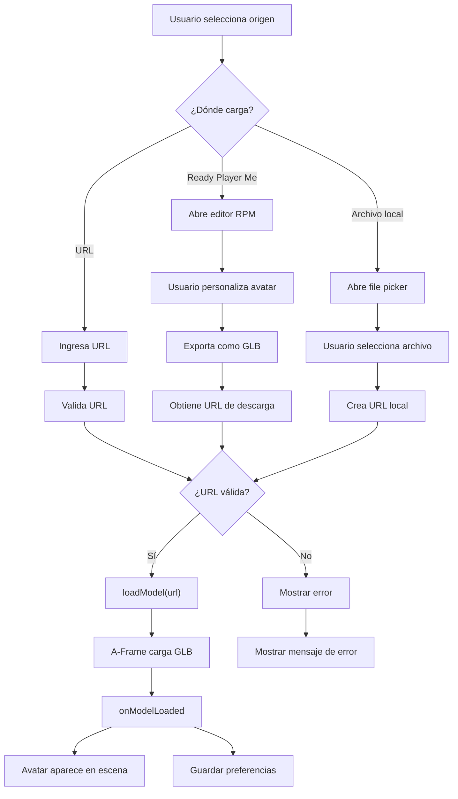

# 🏗️ ARQUITECTURA DEL SISTEMA WebAR

## 1. DESCRIPCIÓN GENERAL

Sistema modular de Realidad Aumentada basado en Web que integra:
- **Detección de marcadores** (AR.js)
- **Renderizado 3D** (A-Frame/Three.js)
- **Gestión de avatares** (Ready Player Me)
- **Interfaz de usuario** (HTML5/CSS3)
- **Gamificación** (Integración Kahoot)

---

## 2. CAPAS DE ARQUITECTURA

```
┌─────────────────────────────────────────────────────┐
│         CAPA DE PRESENTACIÓN (UI/UX)                │
│  ├─ Header con información                         │
│  ├─ Panel de control (derecha)                      │
│  ├─ Modal de ayuda                                  │
│  └─ Footer con estado                              │
└────────────────┬────────────────────────────────────┘
                 │
┌─────────────────────────────────────────────────────┐
│    CAPA DE APLICACIÓN (Lógica Principal)            │
│  ├─ Gestión de estados                             │
│  ├─ Event listeners                                │
│  ├─ Carga de modelos                               │
│  ├─ Interactividad                                 │
│  └─ Gamificación                                   │
└────────────────┬────────────────────────────────────┘
                 │
┌─────────────────────────────────────────────────────┐
│      CAPA DE SERVICIOS (Módulos Especializados)     │
│  ├─ Ready Player Me API                            │
│  ├─ Kahoot Integration                             │
│  ├─ Local Storage Manager                          │
│  ├─ Animation Controller                           │
│  └─ Performance Monitor                            │
└────────────────┬────────────────────────────────────┘
                 │
┌─────────────────────────────────────────────────────┐
│       CAPA DE ESCENA AR (A-Frame/Three.js)          │
│  ├─ Marcador (Tracking)                            │
│  ├─ Contenedor de Avatar                           │
│  ├─ Iluminación                                    │
│  ├─ Cámara                                         │
│  └─ Entidades 3D                                   │
└────────────────┬────────────────────────────────────┘
                 │
┌─────────────────────────────────────────────────────┐
│     CAPA DE DISPOSITIVO (Hardware/Navegador)        │
│  ├─ Cámara Web                                     │
│  ├─ Acelerómetro (opcional)                        │
│  ├─ WebGL Renderer                                 │
│  └─ localStorage                                   │
└─────────────────────────────────────────────────────┘
```

---

## 3. COMPONENTES PRINCIPALES

### 3.1 Componente de Detección de Marcadores

**Archivo:** A-Frame `<a-marker>` con AR.js

```html
<a-marker preset="hiro">
    <a-entity id="avatar-container">
        <!-- Avatares se renderizan aquí -->
    </a-entity>
</a-marker>
```

**Propiedades:**
- Preset: `hiro` (marcador estándar)
- Alternativa: Usar NFT markers para mayor flexibilidad
- Tamaño: Configurable en `config.MARKER_SIZE`

**Flujo:**
```
Cámara captura → AR.js detecta patrón → Posición triangulada 
→ Marcador visible en escena → Avatar aparece
```

### 3.2 Componente de Carga de Modelos

**Archivo:** `script.js - loadModel()`

**Tipos de carga:**
1. **URL Directa** - GLB desde servidor
2. **Archivo Local** - Upload desde dispositivo
3. **Ready Player Me** - Avatar generado dinámicamente

**Validaciones:**
- Peso máximo: 10MB (configurable)
- Formatos: GLB, GLTF, OBJ
- CORS habilitado
- Timeout: 30 segundos

### 3.3 Componente de Interactividad

**Operaciones:**
- Rotación: `rotateModel(angle)`
- Zoom: `zoomModel(factor)`
- Reset: `resetModelTransform()`
- Animaciones: GSAP

**Entrada de usuario:**
- Botones UI
- Gestos móviles (touch)
- Atajos de teclado

### 3.4 Componente de Gamificación

**Integración Kahoot:**
- URL base: `https://kahoot.it/`
- Parámetros: usuario, grupo ID
- Método: Ventana emergente

---

## 4. FLUJO DE DATOS

### 4.1 Flujo de Carga de Avatar



### 4.2 Flujo de Interacción

```
Usuario toca botón
    ↓
Event listener captura click
    ↓
Función correspondiente se ejecuta
    ↓
GSAP anima transformación
    ↓
Estado se actualiza
    ↓
Avatar refleja cambio
    ↓
Feedback visual a usuario
```

---

## 5. ESTRUCTURA DE DATOS

### 5.1 Estado Global (STATE)

```javascript
STATE = {
    currentModel: null,           // Referencia a entidad 3D
    currentModelUrl: null,        // URL del modelo
    isLoading: false,             // Flag de carga
    markerDetected: false,        // Marcador visible
    fps: 0,                       // FPS actual
    userNickname: 'Usuario'       // Nombre del usuario
}
```

### 5.2 Configuración (CONFIG)

```javascript
CONFIG = {
    AR: {
        MARKER_SIZE: 0.1,
        TRACKING_TYPE: 'nft'
    },
    RPM: {
        API_URL: 'https://api.readyplayer.me',
        FORMAT: 'glb'
    },
    MODELS: {
        MAX_SIZE: 10485760,        // 10 MB
        SUPPORTED_FORMATS: ['glb', 'gltf']
    },
    // ... más configuraciones
}
```

### 5.3 Preferencias de Usuario

```javascript
{
    lastAvatar: "https://...",
    userNickname: "Juan",
    lastAvatarUrl: "https://...",
    timestamp: 1715000000
}
```

---

## 6. MÓDULOS Y RESPONSABILIDADES

| Módulo | Archivo | Responsabilidad |
|--------|---------|-----------------|
| **UI Manager** | script.js | Gestión de interfaz y eventos |
| **Model Loader** | script.js | Carga y validación de modelos 3D |
| **Interaction** | script.js | Respuesta a gestos y controles |
| **RPM Integration** | script.js | Comunicación con Ready Player Me |
| **Gamification** | script.js | Integración con Kahoot |
| **Storage Manager** | script.js | Manejo de localStorage |
| **Performance Monitor** | script.js | FPS y métricas |
| **Configuration** | config.js | Parámetros globales |
| **Scene Setup** | index.html | Inicialización de A-Frame |
| **Styling** | styles.css | Diseño y animaciones |

---

## 7. FLUJO DE INICIALIZACIÓN

```
1. DOMContentLoaded
    ↓
2. Cargar scripts externos (A-Frame, AR.js, Three.js)
    ↓
3. Verificar capacidades del navegador
    ↓
4. Inicializar elementos AR
    ↓
5. Configurar event listeners
    ↓
6. Cargar preferencias guardadas
    ↓
7. Iniciar monitoreo de rendimiento
    ↓
8. Solicitar permiso de cámara
    ↓
9. Sistema listo
```

---

## 8. COMUNICACIÓN INTERCOMPONENTES

### 8.1 Mensaje Principal → UI
```javascript
showMessage(text, type) // Mostrar notificación
showError(text)         // Mostrar error
showLoadingSpinner()    // Mostrar spinner
```

### 8.2 Modelo 3D → Estado
```javascript
STATE.currentModel = entity
updateAvatarInfo(url)
```

### 8.3 Preferencias → Storage
```javascript
savePreferences()
loadStoredPreferences()
```

---

## 9. MANEJO DE ERRORES

```
Error en carga
    ↓
Capturado en try-catch
    ↓
Loguear en consola
    ↓
Mostrar mensaje a usuario
    ↓
Limpiar estado
    ↓
Usuario puede reintentar
```

---

## 10. OPTIMIZACIONES

### 10.1 Rendimiento

- **Level of Detail (LoD):** Modelos simplificados en móviles
- **Caché:** Reutilización de modelos cargados
- **Compresión Draco:** Archivos más pequeños
- **Lazy Loading:** Carga bajo demanda

### 10.2 Memoria

- **Límite de texturas:** 2048px en móviles
- **Shadow maps:** Deshabilitados en dispositivos bajos
- **Pooling de geometrías:** Reutilizar meshes

### 10.3 Red

- **GZIP compression:** En servidor
- **CDN:** Para recursos estáticos
- **Timeouts:** 30 segundos para descargas

---

## 11. ESCALABILIDAD

### 11.1 Múltiples Avatares
```javascript
// Futuro
STATE.avatars = [
    { id: 1, url: '...', user: 'Juan' },
    { id: 2, url: '...', user: 'María' }
]
```

### 11.2 Sincronización en Tiempo Real
```javascript
// WebSocket/MQTT
socket.emit('avatarPositionUpdate', state)
socket.on('otherUserAvatar', data)
```

### 11.3 Persistencia
```javascript
// Base de datos
POST /api/avatars { url, user, timestamp }
GET /api/avatars/:userId
```

---

## 12. SEGURIDAD

### 12.1 Validaciones
- ✅ Verificación de HTTPS
- ✅ Validación de URLs
- ✅ Límite de tamaño de archivo
- ✅ Sanitización de entrada

### 12.2 CORS
```javascript
// Dominios permitidos
ALLOWED_DOMAINS = [
    'readyplayer.me',
    'api.readyplayer.me',
    'kahoot.it'
]
```

### 12.3 Privacidad
- ❌ Sin almacenamiento de video
- ❌ Sin rastreo de ubicación
- ✅ Almacenamiento local solo
- ✅ Limpieza de memoria

---

## 13. TESTING

### 13.1 Pruebas Unitarias
- Validación de URLs
- Cálculos de transformación
- Parseo de configuración

### 13.2 Pruebas de Integración
- Flujo de carga de avatar
- Detección de marcadores
- Comunicación RPM

### 13.3 Pruebas de Usuario
- Dispositivos iOS/Android
- Diferentes navegadores
- Marcadores en ángulos variados

---

## 14. DIAGRAMA DE SECUENCIA

```
Usuario    →    UI    →    Loader    →    A-Frame    →    RPM
  │              │           │              │           │
  ├─Click────────→│           │              │           │
  │              │           │              │           │
  │              ├─Validate──→│              │           │
  │              │           │              │           │
  │              ├─Load Spinner             │           │
  │              │           │              │           │
  │              │           ├─Fetch GLB────→           │
  │              │           │              │           │
  │              │           │              ├─Render───→
  │              │           │              │           │
  │              │←Success───┤              │           │
  │              │           │              │           │
  │←Success Msg──┤           │              │           │
  │              │           │              │           │
  └─Interact────→│──Animate──→─Transform────→           │
                 │           │              │
```

---

## 15. CONSIDERACIONES FUTURAS

- 🔄 Soporte para múltiples usuarios simultáneos
- 🎤 Audio/video integrado
- 📊 Analytics de uso
- 🌐 PWA (Progressive Web App)
- 🤖 IA para recomendaciones
- 📱 Versión nativa (React Native)

---

**Documento de Arquitectura - WebAR System v1.0**
